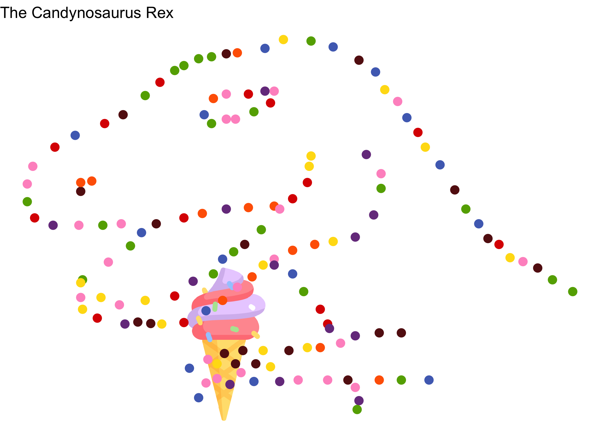

<!-- README.md is generated from README.Rmd. Please edit that file -->

# deptrapr 

<!-- badges: start -->

[](https://github.com/dagousket/deptrapr/actions/workflows/R-CMD-check.yaml)
<!-- badges: end -->

The goal of `{deptrapr}` is to show how managing package dependencies
may lead to CI failures.

## Example

This is a basic example which shows you how to plot a dino in smarties
color :

``` r
library(deptrapr)
data <- fetch_dataset(type = "dino")
#> ✔ Loading dino dataset
p <- plot_dataset(data,
                  type = "ggplot",
                  candy = TRUE,
                  title = "the candynosaurus rex")
p
```



## Code of Conduct

Please note that the deptrapr project is released with a [Contributor
Code of
Conduct](https://contributor-covenant.org/version/2/1/CODE_OF_CONDUCT.html).
By contributing to this project, you agree to abide by its terms.
